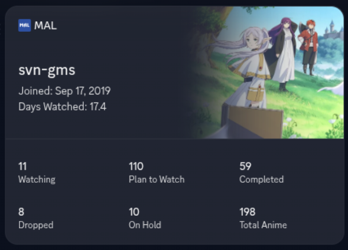

# MyAnimeList Discord Widget


## WARNING

You can no longer create custom widgets on Discord, however if you have already created one in the past then you can modify it.



Only tested on Linux, but should probably work on Windows...

### Making the widget

You can make the widget look however you like but make sure it has the following user data fields

#### Widget Top

| Item name | User data name | Type |
| --- | --- | --- |
| Subtitle 1 | joindate | string |
| Subtitle 2 | dayswatched | string |

#### Widget Bottom

| Item name | User data name | Type |
| --- | --- | --- |
| Stat #1 | watching | number |
| Stat #2 | plantowatch | number |
| Stat #3 | completed | number |
| Stat #4 | dropped | number |
| Stat #5 | onhold | number |
| Stat #6 | totalanime | number |

### .env file

Copy `.env.example` to `.env` and replace all the fields with what it asks

### Build

In the terminal navigate to this folder and type

```bash
cargo build --release
```

### Running

Run it from the project root either with cargo or directly from the executable

```bash
cargo run --release
```

```bash
./target/release/mal-discord-widget
```

Next is to have it run every couple hours. I have modified a bash script called `updater.sh` from [discord-steam-profile-widget](https://github.com/xamionex/discord-steam-profile-widget) that'll run `./mal-discord-widget` every 6 hours, on Linux to run it type

```bash
chmod +x updater.sh
./updater.sh & disown
```

however you will need to do this everytime your server launches so I recommend making a cronjob or a systemd service, but I can't be bothered making one for you so figure it our yourself :p
